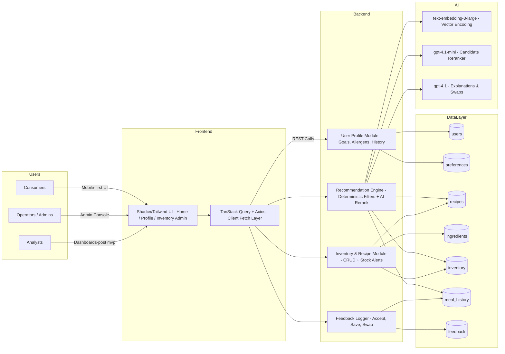

# Architecture Design Record — GoodFork AI Personalization

## 1. Purpose & Scope
This record captures the technical architecture for the GoodFork AI-driven menu personalization experience described in `docs/PRD.md`. It summarizes the in-scope goals, personas, critical components, and integration paths so implementation decisions, tradeoffs, and dependencies remain explicit during the hackathon build.

## 2. Objectives & Non-Goals
- Deliver 3–5 nutritionally balanced meal recommendations per request by blending live inventory, user goals/allergens/preferences, historical behavior, healthy-eating guardrails, and budget targets.
- Provide lightweight AI rationales plus “healthy swap” suggestions when inventory is constrained.
- Keep operator tooling focused on inventory and recipe management; defer payments, multi-language, and advanced analytics dashboards beyond MVP.

## 3. Personas & Interaction Goals
- **Consumers:** Onboard with goals/allergens/preferences, receive personalized menus, inspect nutrition insights, trigger swaps, and log feedback.
- **Operators/Admins:** Maintain recipes, ingredients, and live inventory to ensure recommendations always reflect availability.
- **Analysts (post-MVP):** Explore engagement and conversion metrics plus AI quality, using telemetry emitted by the backend.

## 4. Logical Architecture

## 5. Component Responsibilities
| Layer | Responsibilities | Key Tech |
| --- | --- | --- |
| Frontend (Next.js App Router) | SSR-first experiences for onboarding, recommendations, and lightweight admin tooling; mobile-first responsive UI with Tailwind + Shadcn; TanStack Query + Axios for shared data fetching. | Next.js 14, React Server Components, Shadcn, Tailwind, TanStack Query, Axios |
| Backend (Route Handlers & Server Actions) | Expose REST APIs for onboarding, recommendations, swaps, feedback, and inventory management; orchestrate deterministic filters plus AI integrations; emit analytics events. | Next.js API routes/server actions, Zod validation, telemetry logger |
| Data Layer | Persist profiles, preferences, recipes, ingredients, inventory, meal history, and feedback to support personalization and analytics. | PostgreSQL, Prisma ORM |
| AI Services | Provide semantic retrieval, reranking, and narrative generation for recommendation rationales and healthy swaps. | OpenAI `text-embedding-3-large`, `gpt-4.1-mini`, `gpt-4.1` |

## 6. Data & Integration Notes
- **Deterministic filters:** Allergen exclusions, inventory availability, nutritional guardrails, and budget caps run before AI scoring to guarantee safety.
- **LLM orchestration:** Embeddings power similarity search for candidate meals; the reranker scores shortlists; the generative model crafts rationales and “healthy swap” guidance, falling back to deterministic copy on failure.
- **Inventory fidelity:** Operator CRUD plus nightly ingest keep ingredient quantities current; recommendations degrade gracefully if stock data is stale.
- **Telemetry:** Each request logs requestId, latency, success/failure, and AI response summaries so analysts can validate conversion funnels post-MVP.

## 7. Constraints & Out-of-Scope Items
- No payment workflows, multi-language UX, or deep analytics dashboards in MVP; these remain stretch objectives post-hackathon.
- Security must enforce hashed credentials (bcrypt ≥8 chars), row-level scoping, and log redaction for allergens/PII.
- Availability target is p90 ≤2s with streaming copy allowed; reliability requires deterministic fallback when OpenAI APIs fail.

## 8. Open Questions / Follow-Ups
1. Finalize whether inventory is modeled strictly at the ingredient level or if recipe-level buffering is needed for multi-location readiness.
2. Decide on password reset, email verification, and session strategy to support simple-yet-secure authentication.
3. Determine depth of historical meal tracking required for early personalization versus inferred, transient signals.
4. Clarify pricing granularity (single SKU vs. variants/discounts/taxes) to ensure “budget-friendly” targeting remains credible.

This ADR should be revisited whenever the PRD, database schema, or AI integration strategy materially changes.
